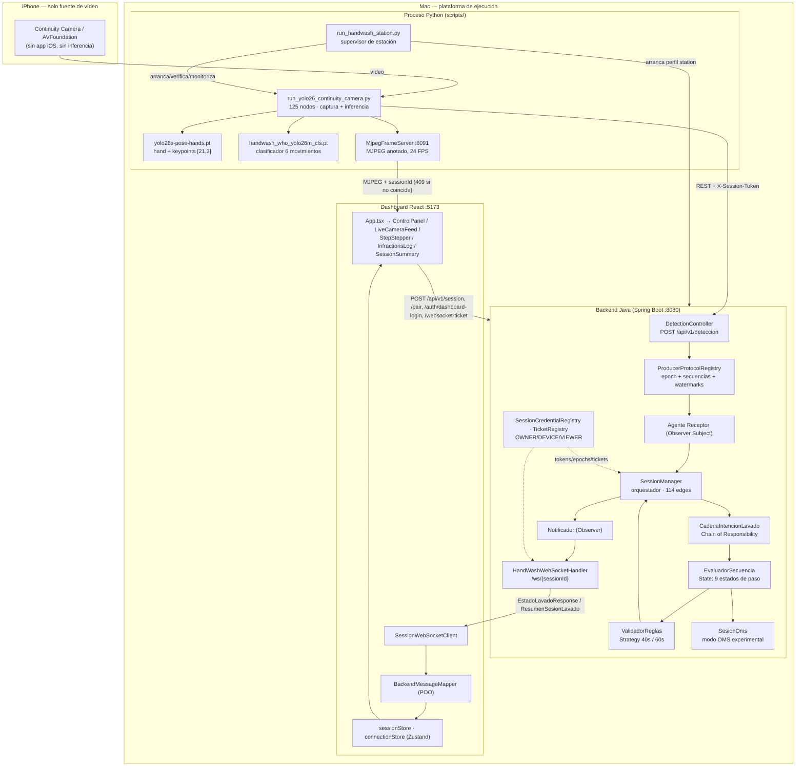

# Grafo detallado del proyecto — PROYECTO-HAND-WASH-YOLO

> Documento de contexto generable/reproducible. Describe **todo lo que existe en el repo**, cómo se conecta
> y dónde está cada pieza, para que un asistente pueda orientarse sin releer 70.000 archivos.
>
> **Fuente:** `graphify-out/graph.json` (grafo AST determinístico) + inspección directa del árbol.
> **Commit con el que se construyó:** `bebe2e09` · **Fecha de generación:** 2026-10-06
> **Refresco tras cambios de código:** `graphify update .` (sin coste de API). Reporte completo: `graphify-out/GRAPH_REPORT.md`.

---

## 0. Cómo consultar este grafo

```bash
graphify god-nodes --top 30                  # hubs arquitectónicos
graphify explain "SessionManager"            # nodo + sus conexiones con archivo:línea
graphify path "A" "B" --undirected           # ruta entre dos nodos (el grafo es NO dirigido)
graphify affected "X" --depth 2              # qué se impacta si cambia X
graphify query "pregunta" --budget 3000      # BFS sobre el grafo
graphify update .                             # regenerar tras tocar código
graphify cluster-only .                       # recomunidades + reporte (si cambió mucho)
```

> ⚠️ El grafo se declaró `directed: false`; **todo `graphify path` necesita `--undirected`** o devolverá "no path".

### Métricas globales del grafo

| Métrica | Valor |
|---|---|
| Nodos | **3.930** |
| Aristas | **8.996** |
| Comunidades (Louvain) | **210** (162 con ≥3 nodos, 48 finas omitidas) |
| Archivos analizados (corpus) | **342** · ~2.065.752 palabras |
| Extracción | 87% `EXTRACTED` (AST) · 13% `INFERRED` (1.167 aristas, confianza media 0.78) |
| Ciclos de importación | **ninguno** |
| Nodos aislados (≤1 conexión) | 517 (mayoritariamente `.body` de SwiftUI y literales de config) |
| Coste LLM del build | 0 (extracción AST determinística) |

**Tipos de nodo:** `code` 3.399 · `document` 281 · `rationale` 217 · `concept` 33.

**Tipos de relación (aristas):**

| Relación | Nº | Significado |
|---|---:|---|
| `calls` | 2.820 | invocación entre funciones/métodos |
| `method` | 1.786 | definición/pertenencia de método |
| `references` | 1.676 | referencia simbólica (tipos, campos, atributos) |
| `contains` | 1.077 | contención (clase→método, archivo→clase) |
| `imports` | 986 | import/require |
| `rationale_for` | 217 | nodo documento/rationale que justifica código |
| `case_of` | 147 | casos de prueba → unidad bajo prueba |
| `imports_from` | 100 | import paquete |
| `uses` | 58 | uso de utilidad |
| `inherits` / `implements` / `extends` | 110 | herencia e interfaces |
| `indirect_call` / `defines` | 19 | llamada indirecta / definición |

---

## 1. Mapa de módulos (distribución de los 3.930 nodos)

| Módulo | Nodos | % | Aristas internas | Qué contiene |
|---|---:|---:|---:|---|
| **backend-main** | 1.109 | 28,2% | 4.452 | `backend/src/main` — Java 17 / Spring Boot 4.1.1, 115 clases |
| **scripts** | 556 | 14,1% | 1.040 | `scripts/` — captura YOLO, estación, entrenamiento, evaluación, tests |
| **backend-test** | 554 | 14,1% | — | `backend/src/test` — 49 clases de prueba |
| **skill-uiux** | 476 | 12,1% | 847 | `frontend/.agents/skills/ui-ux-pro-max/` — skill embebida (BM25 + design system) |
| **archive** | 401 | 10,2% | 564 | FastAPI legado, prototipo iOS, Java static UI, training Windows |
| **sin archivo (símbolos externos)** | 319 | 8,1% | — | `ResponseEntity`, `Test`, `Override`, libs Spring/JUnit/ONNX… |
| **frontend-src** | 142 | 3,6% | 220 | `frontend/src` — React 18 + TS + Zustand + Tailwind 4 |
| **frontend-cfg** | 125 | 3,2% | 117 | `package.json`, `tsconfig.*`, eslint, vite |
| **circuito** | 101 | 2,6% | 138 | ESP32 + sensores + apps móvil (futuro, fuera del runtime) |
| **docs** | 81 | 2,1% | 71 | `docs/` — 12 documentos técnicos |
| **root-docs** | 49 | 1,2% | 46 | `README.md` (54 KB), `AGENTS.md` (45 KB), `SUMMARY.md` |
| **backend-other** | 17 | 0,4% | — | `pom.xml`, `schema.sql`, `application*.yml` |

> **Hallazgo arquitectónico clave:** las aristas cruzadas entre módulos son **prácticamente nulas**
> (backend↔scripts = 0, backend↔frontend = 0, frontend↔scripts = 0). Los tres subsistemas **no comparten código**:
> se acoplan en tiempo de ejecución por HTTP/WebSocket/MJPEG sobre `localhost`. El único "pegamento" estático son
> los símbolos de librería compartidos. Cualquier cambio de contrato debe coordinarse **manualmente**
> (JSON de `DetectionRequest`, códigos de paso, ticket WebSocket), porque el grafo no lo detectará.

---

## 2. Grafo de ejecución (runtime) — el flujo real



### 2.1 Secuencia canónica de una sesión

1. `POST /api/v1/auth/dashboard-login` → credencial **VIEWER** (solo lectura, no rota DEVICE ni epoch).
2. `POST /api/v1/session` (o `/session/pair`) con `producerProtocolVersion: "2"` → sesión estricta v2 + código de vinculación.
3. Dashboard: `POST /api/v1/session/{id}/websocket-ticket` → ticket de un solo uso (TTL ≤ 30 s) → `wss://…/ws/{sessionId}`.
4. Capturador: `POST /api/v1/auth/login` (DEVICE) → `POST /api/v1/session/{id}/producer-epoch` → **epoch autenticado** (ADR-0001).
5. Cada frame: `POST /api/v1/deteccion` con `frameSequence` creciente + `evidenciaMovimiento`/`evidenciaJabon` de la **misma** secuencia → ACK `{accepted, filtered}`.
6. `ProducerProtocolRegistry` valida (bajo lock de sesión) epoch, secuencia, watermark y evidencia **antes** de tocar State/Strategy/Observer.
7. `SessionManager` → `CadenaIntencionLavado` (intención) → `EvaluadorSecuencia` (State) → `ValidadorReglas` (Strategy) → `Notificador` (Observer) → WebSocket.
8. Cierre: `ResumenSesionLavado`. **Nunca** `aprobado=true`: `ClinicalDecisionPolicy` devuelve `clinicalDecisionAllowed=false` en **todos** los perfiles.
9. `DELETE /api/v1/session/{id}` → espera confirmación de purga de caché de intentos (si H2 falla → 503).

---

## 3. Backend Java (`backend/`) — grafo interno

**Stack:** Java 17 · Spring Boot **4.1.1** (`spring-boot-starter-webmvc/websocket/actuator/jdbc/restclient`) · H2 · ONNX Runtime 1.20 · Tomcat 11.0.26 (parcheado) · Jackson BOM 3.1.7 · Maven.
**Artefacto:** `com.handwash:hand-wash-compliance:1.0.0`.
**Volumen:** 115 clases main + 49 test.

### 3.1 Paquetes (`com.handwash.*`)

| Paquete | Clases | Rol en el grafo |
|---|---:|---|
| `api` | 37 | **Fachada HTTP v1**: `AuthController`, `DeploymentStatusController`, `WebSocketTicketController`, 30 DTOs, 3 mappers, `ApiExceptionHandler`, filtros `ApiNoStoreFilter`/`ApiPayloadLimitFilter` |
| `model` | 17 | **Dominio**: `SesionLavado` (117 edges, nodo #1), `DeteccionEvento` (95), `PasoLavado` (89), `EstadoLavadoResponse` (73), `SesionOms` (54), `Infraccion`, `AccionOms`, `RegionJabon`, `EvidenciaJabon`, `EvidenciaMovimiento`, `TipoProtocolo`, `IntentoLavadoResumen`, `Progreso`, `DetallePaso`, `EstadoSesion`, `TipoInfraccion`, `EstadoEvidenciaJabon` |
| `service` | 13 | **Orquestación**: `SessionManager` (114 edges, nodo #2), `ProducerProtocolRegistry`, `HandwashMetrics` (70), `InferenceService`, `InferenceAdmissionGate`, `ImagePayloadValidator`, `RequestRateLimiter`, `ClinicalDecisionPolicy`, `persistence/FailedAttemptPersistenceCoordinator` |
| `state` | 10 | **Patrón State**: `PasoLavadoState` + `EsperandoInicio` → `Palmas` → `Dorsos` → `Interdigitales` → `Nudillos` → `Pulgar` → `PuntaDedos` → `Circulares` → `Completo` |
| `security` | 6 | `SessionCredentialRegistry` (OWNER/DEVICE/VIEWER), `SessionPairingCodeRegistry`, `SessionAuthenticationService`, `SessionTokenResolver`, `WebSocketTicketRegistry`, `WebSocketTicketService` |
| `config` | 6 | `CorsConfig`, `DecoratorConfig`, `ObserverPipelineConfig`, `WebSocketConfig`, **`StationProfileSafetyGuard`**, **`StationReleaseManifestVerifier`** |
| `strategy` | 5 | **Patrón Strategy + Factory Method**: `ReglaValidacionStrategy` ← `ClinicoQuirurgicoStrategy` (60 s) / `DomesticoStrategy` (40 s); `CreadorProtocolo` ← `Objetivo40Segundos`/`Objetivo60Segundos`; `ReglaValidacionStrategyFactory` |
| `controller` | 4 | `SessionController` (10 rutas), `DetectionController`, `InferenceController`, `DevelopmentRootController` |
| `agent` | 4 | **Los 4 agentes**: `Receptor` (79), `EvaluadorSecuencia`, `ValidadorReglas`, `Notificador` (46) |
| `observer` | 3 | `DeteccionObserver`, `Subject`, `DetectionPipelineException` |
| `intention` | 3 | **Chain of Responsibility**: `CadenaIntencionLavado` → `FiltroIntencion` (`EvidenciaReciente`, `DosManos`, `MedicionEspacialValida`, `GestoCompatible`) → `SeguimientoIntencion` |
| `decorator` | 3 | **Patrón Decorator**: `DecoradorMetricasEstrategiaLavado` + `FabricaDecoradorMetricasLavado` (strategy), `SqlInjectionGuardFailedAttemptStoreDecorator` (repository) |
| `repository` | 2 | `FailedAttemptStore`, `FailedAttemptRepository` (H2) |
| `websocket` | 1 | `HandWashWebSocketHandler` (salida hacia dashboard; cierre `1003` si el cliente envía datos) |

### 3.2 Los 6 patrones → ubicación exacta en el grafo

| Patrón | Implementación | Archivos |
|---|---|---|
| **State** | progresión obligatoria de pasos | `state/PasoLavadoState` + 8 estados concretos; contexto `SesionLavado`/`SesionLavadoContext` |
| **Strategy** | protocolos intercambiables | `strategy/ReglaValidacionStrategy`, `ClinicoQuirurgicoStrategy`, `DomesticoStrategy` |
| **Observer** | ingesta desacoplada de detecciones | `observer/Subject`+`DeteccionObserver`; `agent/Receptor` es el Subject; `agent/Notificador` y `NotificadorWebSocket` son consumidores |
| **Factory Method** | creación de la Strategy | `strategy/CreadorProtocolo` → `Objetivo40Segundos`/`Objetivo60Segundos`; selector `ReglaValidacionStrategyFactory` |
| **Chain of Responsibility** | filtro de intención | `intention/CadenaIntencionLavado` → `FiltroIntencion` → `SeguimientoIntencion` |
| **Decorator** | métricas de strategy + guard SQL | `decorator/strategy/*`, `decorator/repository/SqlInjectionGuardFailedAttemptStoreDecorator` (composición en `config/DecoratorConfig`) |

### 3.3 API REST canónica

Base versionada `/api/v1/...` (alias legada `/api/...` conservada).

| Método + ruta | Controlador | Notas |
|---|---|---|
| `POST /api/v1/auth/login` | `AuthController` | credencial **DEVICE** del capturador |
| `POST /api/v1/auth/dashboard-login` | `AuthController` | credencial **VIEWER** de solo lectura |
| `POST /api/v1/session` | `SessionController` | crea sesión, exige `producerProtocolVersion:"2"` en station |
| `GET /api/v1/session/active` | `SessionController` | única sesión no terminal |
| `POST /api/v1/session/pair` | `SessionController` | v2 → sesión estricta, invalida epoch previo |
| `POST /api/v1/session/{id}/producer-epoch` | `SessionController` | registra proceso Python (X-Session-Token) |
| `GET /api/v1/session/{id}` | `SessionController` | estado |
| `GET /api/v1/session/{id}/attempts` | `SessionController` | fuerza vaciado de caché de fallos; **503** si no puede |
| `DELETE /api/v1/session/{id}` | `SessionController` | purga; espera confirmación H2 |
| `PATCH /api/v1/session/{id}` | `SessionController` | actualización |
| `GET /api/v1/protocols` · `/protocols/oms` | `SessionController` | catálogo 40 s / 60 s / OMS |
| `POST /api/v1/deteccion` | `DetectionController` | **entrada del modelo** → ACK `{accepted,filtered}` (+`?includeState=true`) |
| `POST /api/v1/infer` | `InferenceController` | inferencia ONNX de imagen |
| `POST /api/v1/session/{id}/websocket-ticket` | `WebSocketTicketController` | canje VIEWER → ticket WS 1-uso ≤30 s |
| `GET /api/v1/deployment/status` | `DeploymentStatusController` | modo (dev/demo/piloto/no verificado) que pinta el dashboard |
| `GET /` | `DevelopmentRootController` | solo desarrollo |

Filtros transversales: `ApiNoStoreFilter` (`no-store`/`Pragma`/`Expires` en `/api/**`), `ApiPayloadLimitFilter`.
Manejador global: `ApiExceptionHandler` → `ApiErrorResponse`.

### 3.4 Perfiles Spring y barreras de seguridad

| Perfile | Archivo | Comportamiento |
|---|---|---|
| `local` (desarrollo) | `application-local.yml` | único que permite ejercitar la ruta OMS experimental |
| `station` | `application-station.yml` | `oms.model-ready=false` / `oms.input-enabled=false` por defecto; los pone a `true` **solo** tras verificar firma Ed25519 + hashes + taxonomía de 36 clases OMS |
| `station-demo` | `application-station-demo.yml` | `--unvalidated-demo`: **nunca** habilita OMS; loopback + auth + v2 + una sesión |

Guardas: `StationProfileSafetyGuard` (BeanFactoryPostProcessor — congela overrides no revisados) y
`StationReleaseManifestVerifier` (firma Ed25519 de `backend/models/model-manifest.json` con clave externa
`HANDWASH_RELEASE_PUBLIC_KEY_PATH`, SHA-256 de JAR/pesos/scripts/SBOM CycloneDX 1.6).

### 3.5 Nodos puente (mayor betweenness) — por qué importan

| Nodo | Edges | Rol de puente |
|---|---:|---|
| `SessionManager` | 114 | conecta controller ↔ agentes ↔ security ↔ métricas ↔ tests (betweenness 0,029) |
| `DeteccionEvento` | 95 | DTO que atraviesa HTTP → mapper → agente → modelo → WS (0,022) |
| `SesionLavado` | 117 | corazón del dominio: state, strategy, infracciones, progreso, resumen (0,021) |

**Si tocas uno de estos tres nodos, revisa todo su entorno.**

---

## 4. Frontend (`frontend/`) — dashboard React

**Stack:** React 18.3 · TypeScript 5.6 · Vite 6 · **Zustand 5** · Tailwind 4 · Vitest 4 + Testing Library · lucide-react · clsx/tailwind-merge.
**Scripts:** `dev` · `build` (`tsc --noEmit && vite build`) · `lint` · `test` · `preview`.
**Servido en** `http://127.0.0.1:5173/`.

```
frontend/src/
├── App.tsx                      → ControlPanel, LiveCameraFeed, DeploymentNotice, STREAM_URL
├── main.tsx
├── components/                  8 piezas funcionales
│   ├── ConnectionStatusBadge.tsx   (statusConfig + ConnectionStore)
│   ├── ControlPanel.tsx            Iniciar/Detener
│   ├── DeploymentNotice.tsx        banner de modo (nunca "producción clínica")
│   ├── InfractionsLog.tsx          historial acotado de infracciones
│   ├── LiveCameraFeed.tsx          MJPEG + estado de stream
│   ├── SessionSummary.tsx          resumen final (jamás `aprobado`)
│   └── StepStepper.tsx             stepper de 7 pasos
├── hooks/
│   ├── useSession.ts             → API_URL + messageMapper + useWebSocket
│   └── useWebSocket.ts           conexión/diagnóstico
├── lib/
│   ├── BackendMessageMapper.ts   ← POO exigida por AGENTS.md (mapeo WS→dominio)
│   ├── DeploymentStatusService.ts  GET /api/v1/deployment/status + fallback
│   ├── RuntimeEndpointConfig.ts  endpoints runtime
│   ├── SessionWebSocketClient.ts (TicketProvider + WebSocketFactory)
│   └── utils.ts
├── stores/
│   ├── sessionStore.ts           SessionStore, appendUniqueInfraction (1 actualización Zustand/mensaje)
│   └── connectionStore.ts        ConnectionStore
├── types/index.ts                HandWashStep, FRICTION_STEPS, Protocolo, SessionState,
│                                 InfractionEvent, DetectionStateUpdate, EvaluationMode, ConnectionState
└── test/                         17 archivos de prueba (Vitest)
```

Skills embebidas (no son código de producto pero sí del grafo): `frontend/.agents/skills/ui-ux-pro-max/`
(BM25 + `design_system.py` + `validate_data.py`, 476 nodos) y `realtime-detection-ui.md`,
`clinical-monitor-design.md`.

---

## 5. `scripts/` — proceso Python (captura, estación, ML)

### 5.1 Runtime (se ejecuta en la Mac)

| Script | Nodos | Rol |
|---|---:|---|
| **`run_yolo26_continuity_camera.py`** | **125** | *nodo más grande del grafo*. Enumera iPhone (AVFoundation), captura 960×540, inferencia pose 320 px → 640 px, clasificador auxiliar, recorte/inset, votos temporales, filtros (`TemporalStepFilter`, `HandMotionEstimator`, `detect_domain`, `best_detection`, `canonical_step_name`), servidor MJPEG 8091 (720×405, ≤24 FPS), productor REST v2 (`CameraFrameSequence`, `ProducerEpochStream`, cola acotada `enqueue_latest_detection`), validación de manifiesto (`verify_model_artifact`) |
| **`run_handwash_station.py`** | 57 | supervisor de estación: valida manifiesto+firma antes de arrancar, puertos 8080/8091 libres, perfil `station`, catálogo del backend, entorno hijo *allowlist*, reintentos YOLO (≤3 backoff), Ctrl+C ordenado |
| `start_handwash.sh` | 4 | arranque local (`require_command`, `start_if_missing`, `wait_for_http`) |
| `run_backend_yolo_foreground.sh` | — | backend + YOLO en primer plano |
| `build_handwash_station.sh` | — | genera los dos SBOM (Java CycloneDX 1.6 + Python desde lock) |
| `verify_handwash_project.sh` / `audit_dependencies.sh` | — | verificación del repo / auditoría de dependencias |
| `yolo26_camera_service.py` (en archive) | 13 | gateway FastAPI experimental (`infer_frame`, `health`) |

### 5.2 Datos y entrenamiento (se ejecutan **fuera** de esta Mac)

`prepare_grouped_yolo_dataset.py` (89 nodos, comunidad #1) · `prepare_dataset5.py` · `prepare_oms_review_frames.py`
· `rebalance_dataset.py` · `dataset_contracts.py` · `audit_yolo_split_duplicates.py` ·
`train_handwash_who.py` · `train_handwash_robust.py` · `train_handwash_mfh.py` · `train_hand_hygiene_transfer.py`
· `train_dataset5.py` · `train_v2.py` · `train_yolo26_seg.py` ·
evaluación: `evaluate_who_classifier.py` · `evaluate_derived_detector.py` · `evaluate_derived_sequence.py`
· `validate_handwash_models.py`.

### 5.3 Tests Python (12 ficheros)

`test_run_yolo26_continuity_camera.py` (95 nodos, #2 del grafo) · `test_run_handwash_station.py` (44) ·
`test_prepare_grouped_yolo_dataset.py` · `test_handwash_motion.py` · `test_evaluate_derived_sequence.py`
· `test_prepare_oms_review_frames.py` · `test_audit_yolo_split_duplicates.py` · `test_train_handwash_robust.py`
· `test_train_handwash_who.py` + `scripts/testdata/`.

---

## 6. Datos, modelos y entrenamiento

| Ruta | Contenido |
|---|---|
| `backend/models/` | **pesos activos**: `yolo26s-pose-hands.pt`, `handwash_who_yolo26m_cls.pt` (fallback `FRICCION_PARCIAL`), `handwash_yolo26n_7pasos.pt`, `yolo26_hand_pose_candidate.pt`, `handwash_stage_classifier.pt`, `step_classifier.onnx` + `model-manifest.json` (hashes/roles) + `README.md` (16 nodos) |
| raíz | `yolo26n.pt`, `yolo26n-seg.pt`, `yolo26n-obb.pt` (pretrained) |
| `datasets/` | `handwash_public_7steps/`, `handwash_public_7steps_grouped_2026-10-02/`, `handwash_public_7steps.yaml` |
| `ENTRENAMIENTO/derived_handwash_yolo26_cls_2fps_2026-09-26/` | clasificador derivado a 2 FPS (54.623 ficheros — imágenes, **gitignored**) |
| `DataSet5_YOLO/`, `runs/` | dataset 5 y runs de entrenamiento |
| locks | `requirements-camera.txt` + `.lock` (CPython 3.14.4/macOS arm64), `requirements-sbom-generator.*` |

---

## 7. `circuito/` — integración IoT (futuro, fuera del runtime)

`01_DOCUMENTACION/PLAN_SETORES_HANDWASH.md` (34 nodos, comunidad #39) · guías de cableado
(VL53L0X láser, MPU6050 IMU, I2C, protocolo Bluetooth) · código: `esp32/lavamanos_sensores.ino`,
`android/MainActivity.kt`, `ios/BluetoothService.swift` + `SensorViewModel.swift` + `SensorViews.swift`.
Comunidades del grafo: `BluetoothService` (13), `MainActivity` (5), `SensorViewModel` (4), `View` (24),
`WashingState` (9), `YOLODetector` (10), `InferencePipeline` (9).

---

## 8. `archive/` — código histórico (no entra en build ni arranque)

| Ruta | Contenido | Nodos |
|---|---|---:|
| `archive/legacy-fastapi/` | **primer backend**: `main.py` + `agents/evaluador_secuencia.py` (46), `validador_reglas.py` (35), `notificaciones.py` (29), `receptor.py`, `schemas/models.py` (patrones ya allí) | ~210 |
| `archive/experimental_fastapi_yolo/` | gateway YOLO (`yolo26_camera_service.py`, `run_yolo26_camera.py`) | ~40 |
| `archive/ios-prototype/` | **prototipo iOS descartado** SwiftUI: `HandWashCompliance.swift` (51), `Views/ContentView`, `CameraPreview`, `CompletionOverlay`, `ConnectionStatus`, `ViewModel` (`HandWashViewModel` ×2 comunidades), `CameraManager` | ~130 |
| `archive/java-static-ui/` | `index.html`, `test.html` | — |
| `archive/windows-training/` | `TEMP_CHECK.ps1` | — |
| `archive/docs/SUMMARY_legacy.md` | resumen legado (29 nodos) | 29 |

> **Regla:** los artefactos iOS se consideran descartados y **no deben reintroducirse como requisito de ejecución**.

---

## 9. `docs/` + documentación raíz

| Documento | Nodos | Tema |
|---|---:|---|
| `README.md` (raíz, 54 KB) | 24 | referencia canónica de rutas, TTL, límites |
| `AGENTS.md` (raíz, 45 KB) | 18 | reglas operativas, arquitectura de agentes, contratos JSON |
| `SUMMARY.md` | 7 | resumen operativo |
| `docs/architecture/adr-0001-producer-epoch-integrity.md` | 18 | **ADR**: epoch autenticado + secuencia de frames |
| `docs/BACKEND_JAVA.md` | 9 | backend Java |
| `docs/OPERATIONS_STATION.md` | 7 | operación de estación local |
| `docs/PATRONES_E_INTENCION.md` | 7 | 6 patrones Java + heurística de intención |
| `docs/REQUISITOS_MODELO_OMS.md` | 7 | puerta de aceptación para modelo OMS |
| `docs/PERFORMANCE_BASELINE_2026-09-27.md` | 10 | baseline de latencia + cargas |
| `docs/DEPENDENCY_SECURITY_AUDIT_2026-10-04.md` | 6 | auditoría de dependencias |
| `docs/VERIFICACION_2026-09-25.md` · `MODELOS_ENCONTRADOS.md` · `GOOGLE_COLAB_ENTRENAMIENTO.md` + 2 notebooks | — | verificación, modelos, entrenamiento en Colab |

---

## 10. Comunidades principales (de 210)

| # | Nombre | Tamaño | Cohesión | Agrupa |
|---:|---|---:|---:|---|
| 0 | `IntentoLavadoResumen` | 90 | 0,05 | config Spring (Cors/Decorator/WebSocket) + decoradores + resúmenes de intento |
| 1 | `prepare_grouped_yolo_dataset.py` | 89 | 0,05 | pipeline de dataset agrupado + dedupe (`ImageSignature`, `DuplicateCandidate`) |
| 2 | `.crearSesion` | 69 | 0,09 | `DeteccionEvento` + tests de `SessionManager` |
| 3 | `HandwashMetrics` | 65 | 0,06 | métricas, `ExpirationCause`, fábrica de decoradores |
| 4 | `run_handwash_station.py` | 62 | 0,06 | supervisor: readiness, entorno hijo, pairing |
| 5 | `org.junit.jupiter.api.Test` | 60 | 0,09 | tests unitarios backend |
| 6/7/20/50/51 | `DesignSystemGenerator`, `validate_data.py`, `design_system.py`, `_select_palette_for_mode`, `search` | 60/58/43/14/7 | — | skill `ui-ux-pro-max` (BM25, paletas WCAG, design tokens) |
| 8 | `EstadoLavadoResponse` | 56 | — | DTO de salida hacia WS |
| 9 | `ContinuityCameraDetectionTest` | 56 | 0,04 | `TemporalStepFilter`, `HandMotionEstimator`, `hand_framing_hint`, validación de labels |
| 10 | `Notificador` | 55 | 0,09 | Observer + `HandWashWebSocketHandler` |
| 11 | `TipoProtocolo` | 50 | 0,08 | estados de sesión + `EvidenciaMovimiento` |
| 12/17/18 | `HandWashViewModel`, `SwiftUI` | 46/44/44 | — | **prototipo iOS archivado** |
| 13 | `Receptor` | 46 | 0,12 | Subject + validación de payload |
| 14/16/22 | `StationReleaseManifestVerifier(Test)`, `StationSupervisorPolicyTest` | 46/45/43 | 0,17 | **barrera de release hospitalario** |
| 15 | `train_handwash_who.py` | 46 | 0,10 | entrenamiento OMS + tests |
| 19 | `SessionManager` | 44 | 0,09 | orquestación + tickets |
| 23 | `run_yolo26_continuity_camera.py` | 43 | 0,07 | productor v2, secuencias, catálogo de taxonomía |
| 27/38 | `SesionLavado`, `SesionOms` | 40 | 0,09/0,10 | dominio clínico y OMS |
| 29 | `WebSocketTicketRegistry` | 21 | 0,09 | tickets, `IssueOutcome`, capacidades |
| 30/61/112–113 | `PasoLavadoState` + estados concretos | 13/7/4/4 | 0,10–0,23 | **máquina de estados** |
| 31 | `ValidadorReglas` | 18 | 0,08 | Strategy 40/60 s |
| 32/33/57/66/70 | `AuthController`, `SessionController`, `ApiErrorResponse`, `InferenceController`, DTOs de sesión | 15/13/12/11/8 | 0,11–0,14 | capa REST |
| 37 | `evaluador_secuencia.py` | 31 | 0,11 | backend FastAPI legado |
| 39 | `PLAN_SETORES_HANDWASH.md` | 33 | 0,06 | plan ESP32 + sensores |
| 42/78 | `CadenaIntencionLavado`, `FiltroIntencion` | 4/5 | 0,11/0,16 | **Chain of Responsibility de intención** |
| 45/48/65 | `Infraccion`, `AccionOms`, `RegionJabon` | 13/19/16 | 0,08–0,10 | taxonomías de infracción/acción/regiones de jabón |
| 49 | `ReglaValidacionStrategy` | 6 | 0,11 | Factory Method 40/60 s |
| 53 | `SessionCredentialRegistry` | 9 | **0,15** | OWNER/DEVICE/VIEWER |
| 54 | `ProducerRejectionReason` | 26 | 0,08 | 22 motivos de rechazo v2 (cardinalidad finita) |
| 55 | `ProducerProtocolRegistry` | 6 | **0,24** | epoch + streams (cohesión alta) |
| 63/90 | `InferenceService`, `InferencePipeline` | 5/9 | 0,17 | ONNX (Android `ai.onnxruntime` en archive) |
| 74 | `verify_model_artifact` | 9 | 0,12 | integridad de pesos al arrancar |
| 76 | `BackendMessageMapper` | 5 | **0,24** | puerta de contratos WS→UI (`STEP_CODES`, `SOAP_EVIDENCE_CODES`) |
| 81 | `ADR-0001` | 17 | 0,11 | decisión de epoch/sequencia |
| 82 | `Queue` | 7 | 0,19 | cola de envío del productor Python |
| 114 | `MjpegFrameServer` | 4 | 0,18 | MJPEG ligado a `sessionId` |
| 129 | `DetectionOutcome` | 9 | 0,22 | `ACCEPTED/FILTERED/INVALID/UNAUTHORIZED/TRANSPORT_REJECTED…` |
| 145/146/152/163 | docs de operación, patrones, backend, sistema | 6/6/7/6 | 0,28–0,33 | documentación normativa |

---

## 11. Vacíos y advertencias del grafo

1. **517 nodos con ≤1 conexión** — mayoritariamente `.body`/`.color`/`.icon` de SwiftUI archivado y literales de `tsconfig`. No son deuda real, pero **no hay edges** para: `Contents.json`, `model-manifest.json`, `group_split_manifest.json`, `catalog-summary.json` (20 ficheros JSON dieron 0 nodos).
2. **1 `.sql` sin extraer**: falta `tree_sitter_sql` → `schema.sql` no está en el grafo (`pip install "graphifyy[sql]"`).
3. **48 comunidades finas (<3 nodos)** omitidas del reporte → usar `graphify query`.
4. **Cohesiones bajas** en comunidades 0 (0,05) y 1 (0,05): candidatas a partir si se refactoriza config Spring o el pipeline de dataset.
5. **Sin ciclos de importación** ✅.
6. **1.167 aristas INFERRED** (confianza 0,78): sobre todo en `archive/ios-prototype` (`.body → ContentView → HandWashViewModel → CameraPreviewView`) y en `ContinuityCameraDetectionTest ↔ HandMotionEstimator/TemporalStepFilter`. Verificar antes de basarse en ellas.
7. **El acoplamiento runtime (HTTP/WS/MJPEG) es invisible para el grafo.** Los contratos que hay que coordinar a mano:
   - `DetectionRequest` (JSON de entrada) ↔ payload Python del capturador.
   - Códigos de paso: `PASO_1_PALMAS`…`PASO_7_CIRCULARES` (wire canónico) ↔ `HandWashStep`/`FRICTION_STEPS` TS ↔ `PasoLavado` Java.
   - `evidenciaJabon` + `evidenciaJabonSecuencia` (misma `frameSequence`).
   - Ticket WS de un solo uso y `sessionId` compartido con el proceso MJPEG.
   - `GET /api/v1/deployment/status` → banner de modo del dashboard.

---

## 12. Índice rápido: "quiero entender X" → empieza por aquí

| Quiero entender… | Lee / consulta |
|---|---|
| El flujo completo | §2 de este documento + `README.md` + `AGENTS.md` §2 |
| La máquina de estados de pasos | `backend/.../state/*` + `model/SesionLavado.java` → `graphify explain "SesionLavado"` |
| Validación de tiempos 40/60 s | `strategy/*` + `agent/ValidadorReglas.java` → `graphify explain "ReglaValidacionStrategy"` |
| Integridad del productor v2 | `docs/architecture/adr-0001-*.md` + `service/ProducerProtocolRegistry.java` |
| Autenticación y tickets | `security/*` → `graphify explain "SessionCredentialRegistry"` |
| Captura, pose y votos | `scripts/run_yolo26_continuity_camera.py` (125 nodos) |
| Barrera de release hospitalario | `config/StationReleaseManifestVerifier.java` + `StationProfileSafetyGuard.java` + `scripts/run_handwash_station.py` |
| Dashboard y su estado | `frontend/src/App.tsx`, `lib/BackendMessageMapper.ts`, `stores/sessionStore.ts` |
| Por qué no hay "aprobado clínico" | `service/ClinicalDecisionPolicy.java` (todos los perfiles → `false`) |
| Qué está muerto | `archive/README.md` + §8 |
| Qué se impacta si cambio X | `graphify affected "X" --depth 2 --undirected` |

---

## 13. Mantenimiento del grafo

```bash
graphify update .            # tras cambiar código (barato, sin LLM)
git rev-parse HEAD           # debe coincidir con "Built from commit" de GRAPH_REPORT.md
graphify cluster-only .      # recomunidades + reporte tras refactor grande
graphify cluster-only . --no-viz   # si el grafo pasa de 5000 nodos
```

- Para nodos de **documentación** (`document`/`rationale`): `/graphify --update` desde el asistente.
- El grafo está en `graphify-out/graph.json` (6,2 MB) + `graph.html` (visualización) + `GRAPH_REPORT.md`.
- `graphify-out/` **no** está en `.gitignore` → se puede versionar para que otros agentes lo reutilicen.
